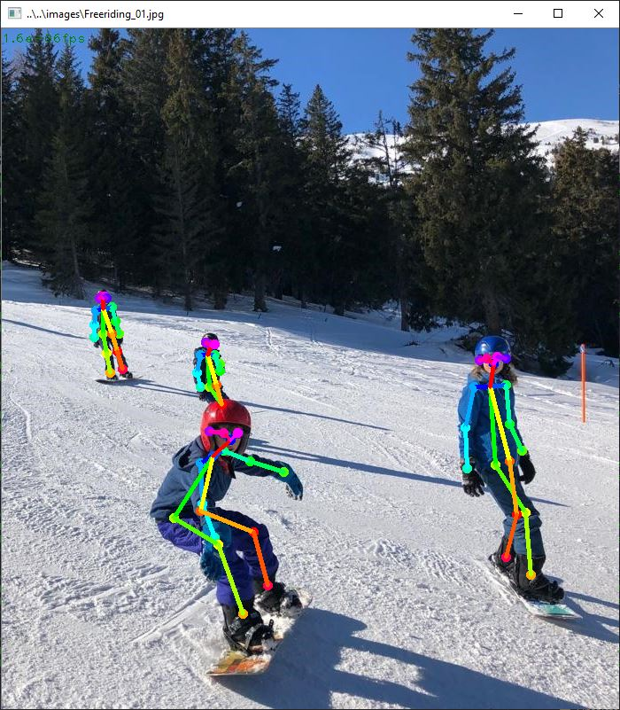

# TensorFlow based Human Pose Estimation in C++
This project demonstrates usage of the Tensorflow C++ interface for pose estimation.

Inference, models and post processing steps have been ported from Python to C++ from [tf-pose-estimation](https://github.com/ildoonet/tf-pose-estimation/) project, which in turn has been inspired by [OpenPose](https://github.com/CMU-Perceptual-Computing-Lab/openpose).

## Dependencies
External libraries are referenced by msbuild targets within the lib project at https://github.com/jenshemprich/lib in order to link against the right library versions for each build configuration and to setup the executable path for running and debugging.

### 3rd-party libraries
+ Clone the lib repository into the same folder as this project.
+ Download and copy OpenCV-Release to the OpenCV-4.0.1 directory within the Lib folder.
+ Follow the instructions to build AVX/AVX2/CUDA versions of the Tensorflow library for Windows.
It takes a few hours to build each configuration - about half a day or so for all, so plan ahead.

### Download the models
For the time being, I'm using existing models (mobilenet_thin, cmu) from[tf-pose-estimation](https://github.com/ildoonet/tf-pose-estimation/tree/master/models/graph), follow the instructions there to download them and place them in the models folder.

## How does it work
An in-depth article about the underlying algorithm can be found [here](https://arvrjourney.com/human-pose-estimation-using-openpose-with-tensorflow-part-2-e78ab9104fc8). With that knowledge, you can easily follow the code in PoseEstimator.cpp. It's a three-step proces consisting of:
1. Inference to retrieve heat maps and part affinity fields.
2. Post-processing to retrieve coordinate candidates
3. Coco model creation from the coordinate candidates by reducing candidates, turn them into body part lists and output a coco model for each recognized pose.

Inference uses the same model, so it's exactly the same, but the post processing implementation is slightly different fromn the Python code. In python you pass  operators as parameters to session.run(). In the tensorflow C++ interface you have to  define them in an separate graph, and then merge it with the inference graph. The session can then created from a single graph that contains all operators.

I've got some trouble with using the inference output as a direct input for the post procesisng, because my tensorflow build crashed on me when assigning a named node from the inference graph as an input for the slice operator.

For the time being, that issue is workarounded by assigning the inference output to an intermediate add op, or alternatively by splitting up the processing into 2 session runs (one for inference, one for post processing). The issue is isolated in a couple of unit tests, to look into it later on.

The tensorflow related part of the post processing was relatively straight forward, the most time consuming part was to create the gaussian kernel for the convolution filter with Eigen instead of Numpy.

Because the C++ ops::where() operator outputs coordinates directly instead of producing another NHWC tensor (as the Python op tf.where does), the coco model creation becomes slightly less complex than in the original code. Besides some refactoring to turn the original Python extension code into a C++ class, the redundant loops to gather the peak infos from the coordinates have been replaced by a sort statement to get them into the right order - the subsequent stages of the algorithm depend on the proper sequernce of coco parts.
